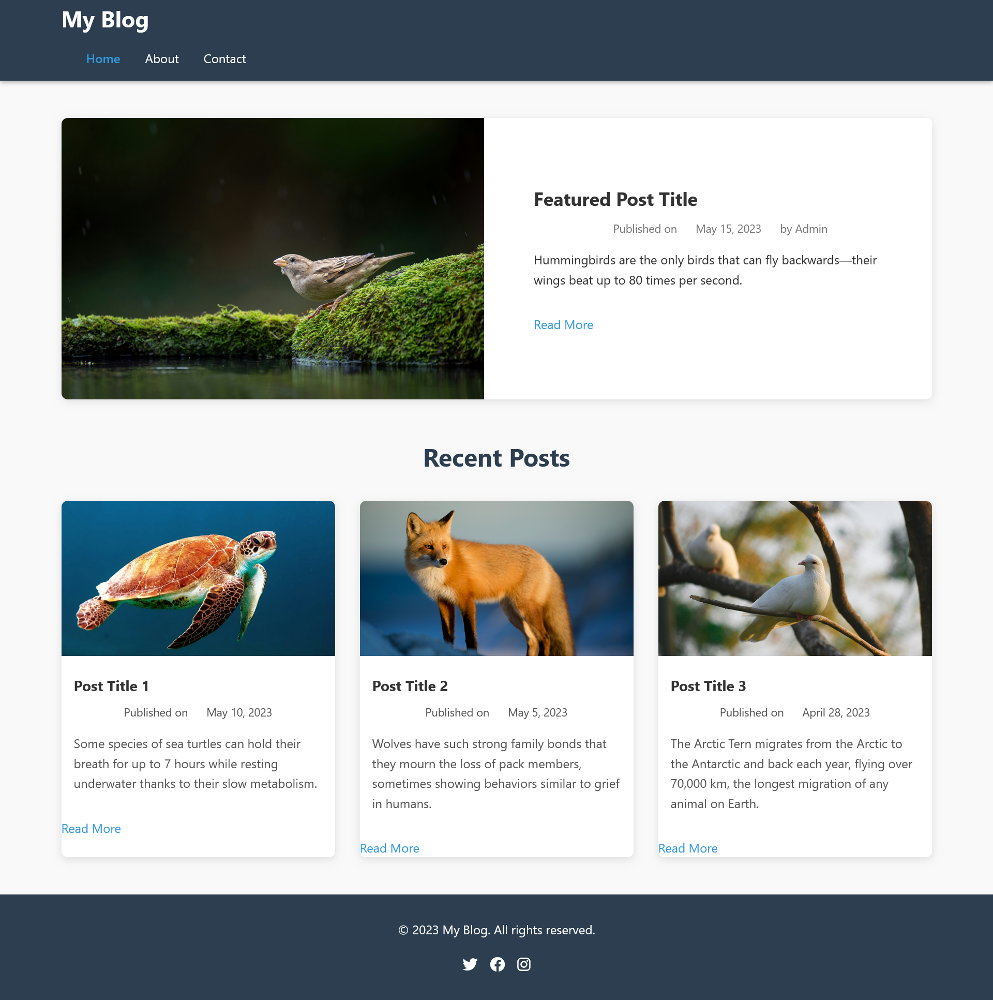

# My Blog Website - README



Link: https://speciesblog.netlify.app/

## Table of Contents
- [Project Overview](#project-overview)
- [Features](#features)
- [Technologies Used](#technologies-used)
- [Installation](#installation)
- [Usage](#usage)
- [Deployment](#deployment)
- [Contributing](#contributing)
- [License](#license)

## Project Overview

This is a fully responsive blog website built with HTML5, CSS3, and JavaScript. The website features multiple pages including a home page with featured posts, about page, contact page, and individual blog post pages.

## Features

✅ **Responsive Design** - Works on all device sizes  
✅ **Multi-page Navigation** - Consistent navigation across all pages  
✅ **Interactive Elements** - Forms with validation, mobile menu toggle  
✅ **Semantic HTML5** - Proper use of semantic elements  
✅ **Modern Styling** - Clean, attractive design with CSS3  
✅ **Blog Functionality** - Post layouts with comments, categories, tags  

## Technologies Used

- **Frontend**:
  - HTML5
  - CSS3 (Flexbox, Grid, Media Queries)
  - JavaScript (DOM Manipulation, Event Handling)
- **Deployment**:
  - Netlify
- **Version Control**:
  - Git
  - GitHub

## Installation

To run this project locally:

1. Clone the repository:
```bash
git clone (https://github.com/PLP-WebTechnologies/feb-2025-final-project-and-deployment-rxymitchy.git)
```

2. Navigate to the project directory:
```bash
cd blog-website
```

3. Open the project in your preferred code editor

4. Launch the website by opening `index.html` in your browser

## Usage

1. **Navigation**:
   - Use the main navigation menu to switch between pages
   - Mobile users can toggle the hamburger menu

2. **Reading Posts**:
   - Browse featured and recent posts on the homepage
   - Click "Read More" to view full posts

3. **Contact Form**:
   - Fill out the form on the Contact page
   - Form includes validation for required fields

4. **Comments**:
   - Leave comments on blog posts
   - View existing comments from other users

## Deployment

The project is deployed using Netlify

To deploy your own version:
1. Upload the project to a GitHub repository
2. Sign in to Netlify with your GitHub account
3. Select "New site from Git" and choose your repository
4. Configure build settings (no build command needed for static sites)
5. Click "Deploy site"

## Contributing

Contributions are welcome!

---

Made with ❤️ by Mitchelle 
📧 Contact: lucianamitchell19@gmail.com
